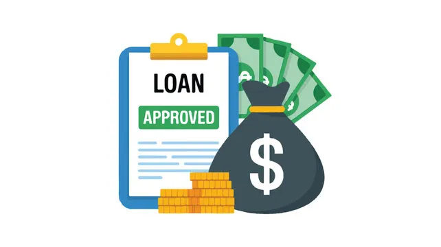
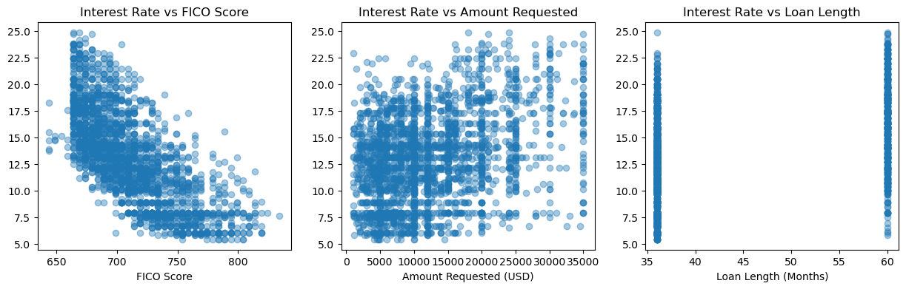
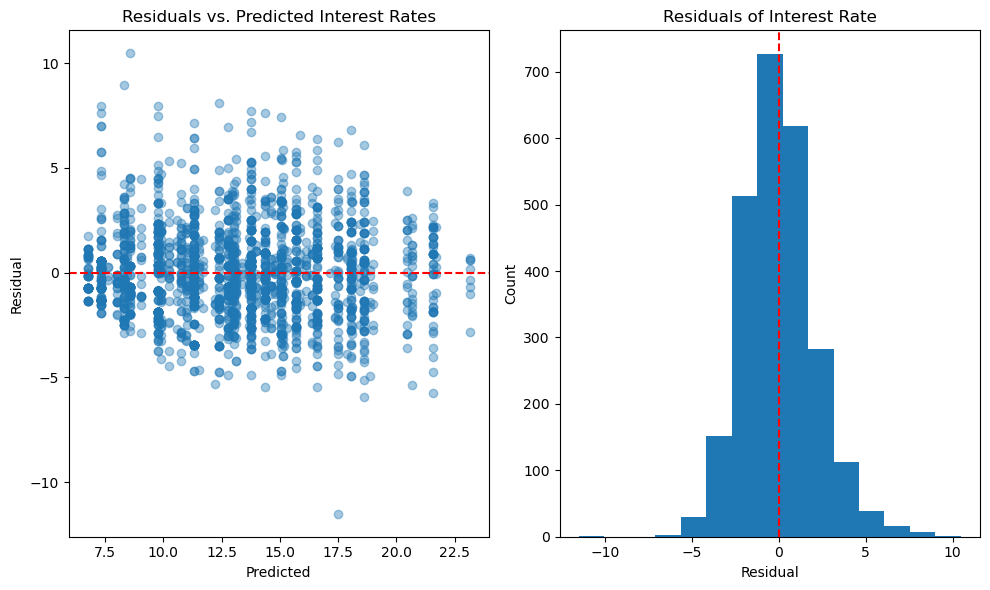

# Loan Interest Rate Regression

### The Project

This analysis was made to predict and discover factors influencing interest rates for loans. Values that were explored included FICO score, the amount requested for the loan, the amount funded by investors, and the length of the loan. We found that some factors influenced the interest rates more than others, as seen by our analysis.

We found that the FICO range column was the most important factor in predicting interest rates for loans.

### Purpose

For business owners applying for loans, the interest rate is a big factor in total overall cost of loans. The lower the cost, the better, and the more we can predict what causes high interest rates, the more we can steer business owners to get the best deals for their loans.

  

___

# 1. Exploring the Data

### Data Overview

The data we were given had only about 2,000 entries, with 6 columns of data. We decided that interest rate was th target, and `fico_range`, `amount_requested`, and `loan_length` were the most important columns to look into. The only cleaning that needed to be done was converting the `fico_range` column into a single integer value to be usable.

### Exploratory Insights

First we looked into some of the relationships between our features and our selected target, interest rate. As seen in the plots below, the FICO score has the most significant effect on interest rate, indicating a negative correlation. As FICO score increases, the interest rate decreases, which is favorable for business owners.

There was a slight correlation between the amount requested and interest rate, but most of the points were scattered.

As for the last plot, we were comparing loan length vs. interest rate. Loan length was only found in values of either 36 or 60 months, and upon comparing the average interest rate values for each of the means, we found that having a 36-month long loan on average correlated with a lower interest rate by about a 4% difference.

| Loan Length (months) | Average Interest Rate |
| -------- | -------- |
| 36.0   | 12.132559   |
| 60.0   | 16.407464   |   

Because of these findings, we chose to look more into the relationship between FICO score and interest rate.

___

# 2. Modeling

### Comparing FICO Score vs. Interest Rates

We found **FICO score** to be the most influential of all the features we looked into. After some testing using both linear regressions and decision tree regressions, we decided that the decision tree regression had the best score.

Our final decision tree score was **0.735**, using **5** as the depth measure.

Finally, we looked into the residual values, using plots to visualize them. Comparing the predicted vs. the residual rates, the spreads were pretty even across both the scatter plot and histogram.

___

# Summary

In summary, we found that FICO score had the most significant impact on the interest rates of loans. For business owners looking into applying for loans, consider applying with a good FICO score to have a better chance of getting a low interest rate.